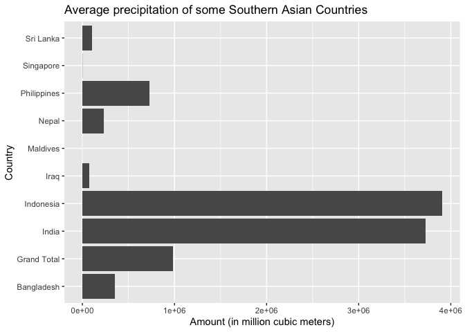
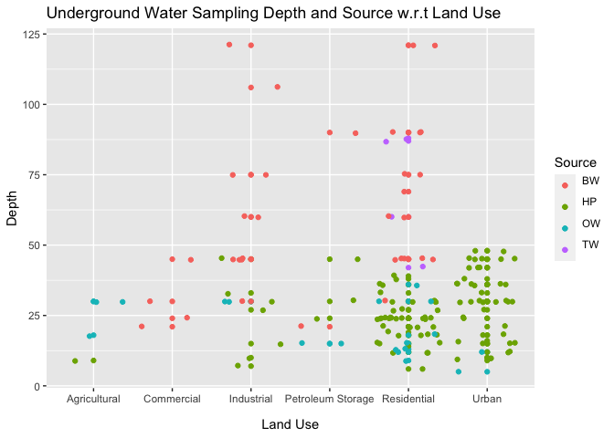
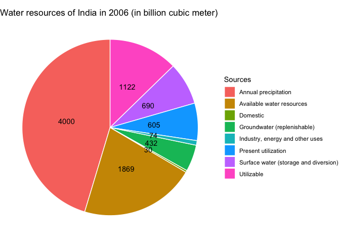

a4 R Notebook
================

Meixian Wu <a href="mailto:meixianw@usc.edu">meixianw@usc.edu</a>
Observable Link: <https://observablehq.com/d/4cd379ee31ae1950>

``` r
library("ggplot2") 
library(RColorBrewer)
```

## Average precipitation of some Southern Asian Countries

``` r
df = read.csv('datasets/precipitation1 Pivot-precipitation1 Pivot.csv')


ggplot() + geom_bar(data = df, aes(x = Value, y = Country), stat = "identity") + ggtitle('Average precipitation of some Southern Asian Countries')+ xlab('Amount (in million cubic meters)')
```

<!-- -->

Explanation: Precipitation datasets described the annual average of
natural precipitation in million cubic meters from 2003-2014. The above
visualization gives the average precipitation of some Southern Asian
Countries that is close to India. We wanted to know the level of
precipitation in India and whether this level is low compared with other
countries with similar latitudes and longitudes. From the Bar plot, we
can see that India has a relative high level of precipitation compared
with its neighboring countries. This could tell us that there are
generally a lack of rain fall in the southern Asia area.

## Underground Water Sampling Depth and Source w.r.t Land Use

``` r
df = read.csv('datasets/undergroundwater_sampling_info.csv')
head(df)
```

    ##   Sl..No.           Location                   Identification Source Depth
    ## 1      60           Irugur\n BPCL side Sentha- Marai Garden\n   OW\n    18
    ## 2      61           Irugur\n            IOCL, HPCL opposite\n   OW\n    30
    ## 3      62           Irugur\n  Near IOCL, HPCL By-pass\nRoad\n   OW\n    30
    ## 4     131     Karmel Nagar\n                    Deepa Nivas\n   HP\n     9
    ## 5      53 Krishnarayapuram\n      Near Waste Transfer\nSite\n   BW\n    24
    ## 6      71     Venkatapuram\n     241/1, Saral\nNursery Garden   BW\n    21
    ##    Water.Use Land.Use_Specific.Activity       City
    ## 1 Domestic\n             Agricultural\n Coimbatore
    ## 2 Domestic\n             Agricultural\n Coimbatore
    ## 3 Domestic\n             Agricultural\n Coimbatore
    ## 4 Drinking\n             Agricultural\n  Vijaywada
    ## 5 Domestic\n                 Commercial Coimbatore
    ## 6 Domestic\n                 Commercial Coimbatore

``` r
#df$Source = factor(df$Source, levels=c(" BW- Bore well", "HP – Hand Pump", "OW - Open Well", "TW- Tube well"))

p <- ggplot(df, aes(Land.Use_Specific.Activity, Depth , color = Source )) + xlab('Land Use') + ggtitle('Underground Water Sampling Depth and Source w.r.t Land Use')
p<-p + geom_point() + geom_jitter()
p
```

<!-- -->

``` r
#Land.Use_Specific.Activity
```

Explanation: the underground sampling info dataset gives the information
about the sampling process and the choices of locations. The legend
stands for ” BW- Bore well”, “HP – Hand Pump”, “OW - Open Well”, “TW-
Tube well”. which are different type of water sources in the sampling
locations. From the above plot, we can see that among the sampling
spots, most of the water is used for residential and urban life, and
extracted by hand pump with low depth. There is also many spots that are
for industrial usage, which required deep extraction from bore well.
Agriculture, commercial, and Petroleum Storage has a few spots that
extracted by either hand pump and open well, which are both low in terms
of the underground depth.

## The Water Resources Composition in one year (2006)

``` r
df = read.csv('datasets/water_recources_of_india.csv')


myPalette <- brewer.pal(5, "Set2") 

ggplot(df, aes(x="", y=Amount, fill=Sources),label= df$Amount ) +
  geom_bar(stat="identity", width=5, color="white") +
  geom_text(aes(label = Amount),
            position = position_stack(vjust = 0.5)) +
  coord_polar("y") + ggtitle('Water resources of India in 2006 (in billion cubic meter)') + theme_void() 
```

<!-- -->

Explanation:

The water resources dataset described the composition of water resources
in India in 2006 in billion cubic meters. We can see that precipitation
occupied the largest percentage, underground water and surface water
also each occupied about 1/10 of the water resources. All other
available water resources gives a large percentage of the whole water
resources(1896), which has miscuolenuous compositions.
